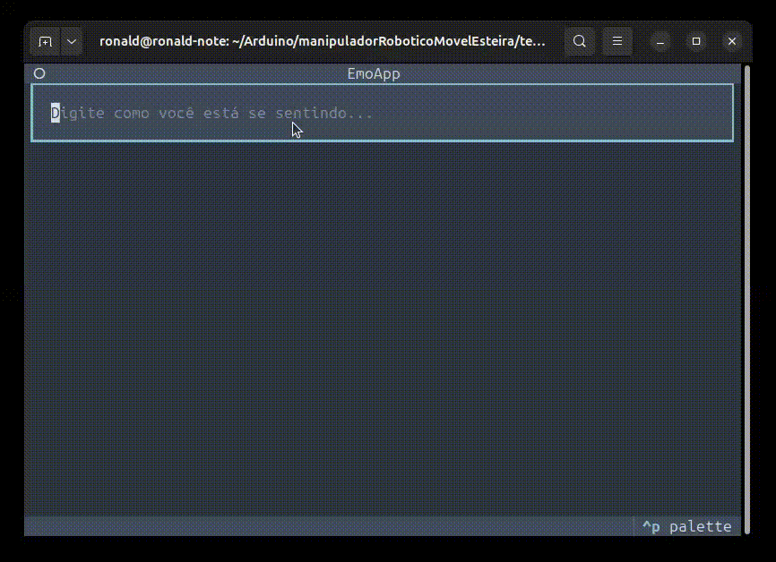

# Emoções CLI LangChain





Este projeto é um experimento, feito para praticar o uso de **LangChain**, e **Textual** no desenvolvimento de uma interface simples em Python.
Meu apreço por aplicações CLI está crescendo.

A aplicação recebe uma descrição de como o usuário está se sentindo e retorna em **JSON**:
- uma explicação curta do motivo,
- a emoção identificada (**feliz**, **triste** ou **naosei**),
- e uma escala numérica de **0 a 10** para o nível de felicidade.

## 🚀 Como executar

Instale as dependências:

```bash
pip install -r requirements.txt

